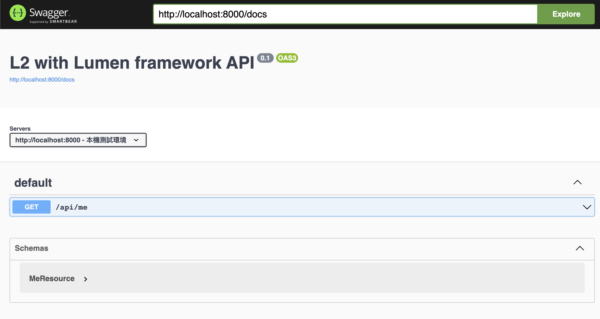
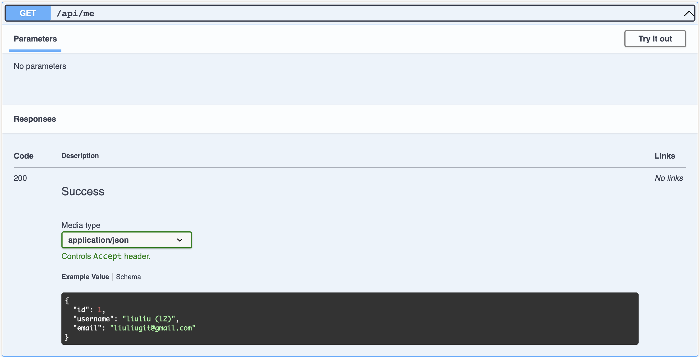

# L2 with Lumen framework

## How to build the project

1. install packages.
  ```shell
  $ composer install
  ```
2. run server.
  ```shell
  $ php -S localhost:8000 -t public

  # link API by http://localhost:8000
  # link Swagger docs by http://localhost:8000/api/documentation
  ```

## Use this project

- [API Project](http://localhost:8000)
- [API Swagger Docs](http://localhost:8000/api/documentation)

## Included fields in the project

- API demo
- Swagger API docs & interactive UI
- PHP Unittest

## Swagger API Docs

- UI demo

- API docs demo


## References

- [Lumen 10.x Document](https://lumen.laravel.com/docs/10.x)
- [Swagger Examples](https://github.com/zircote/swagger-php/tree/master/Examples)
